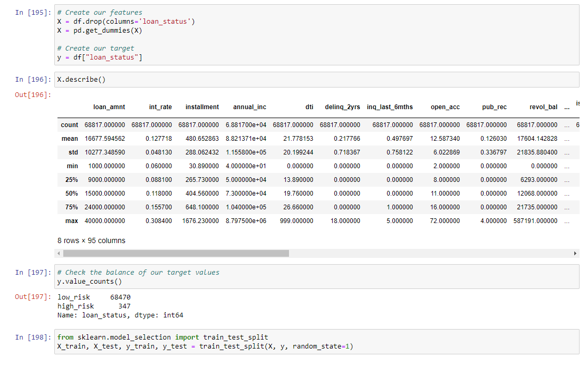
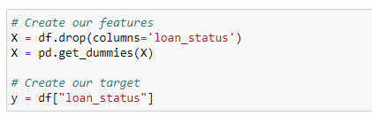
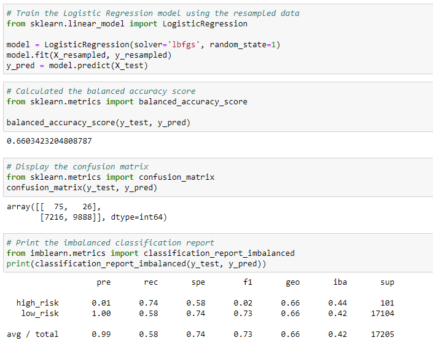
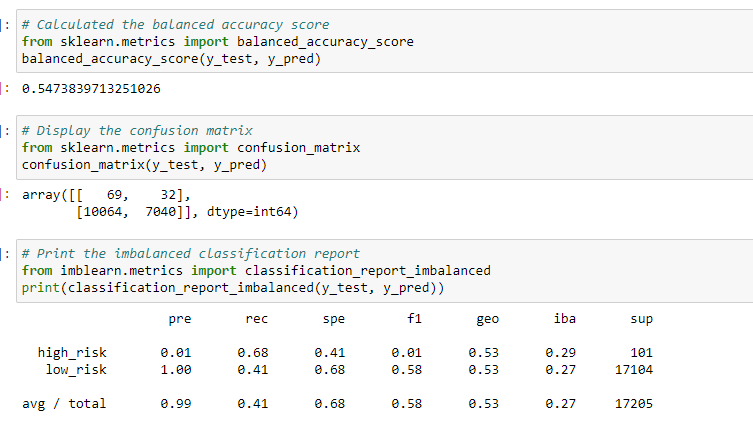
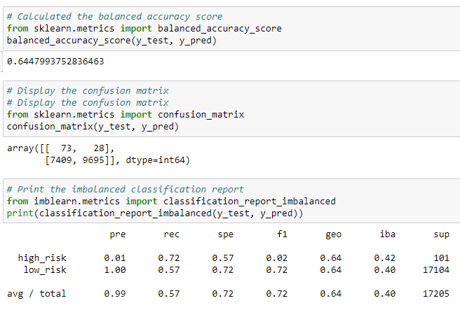
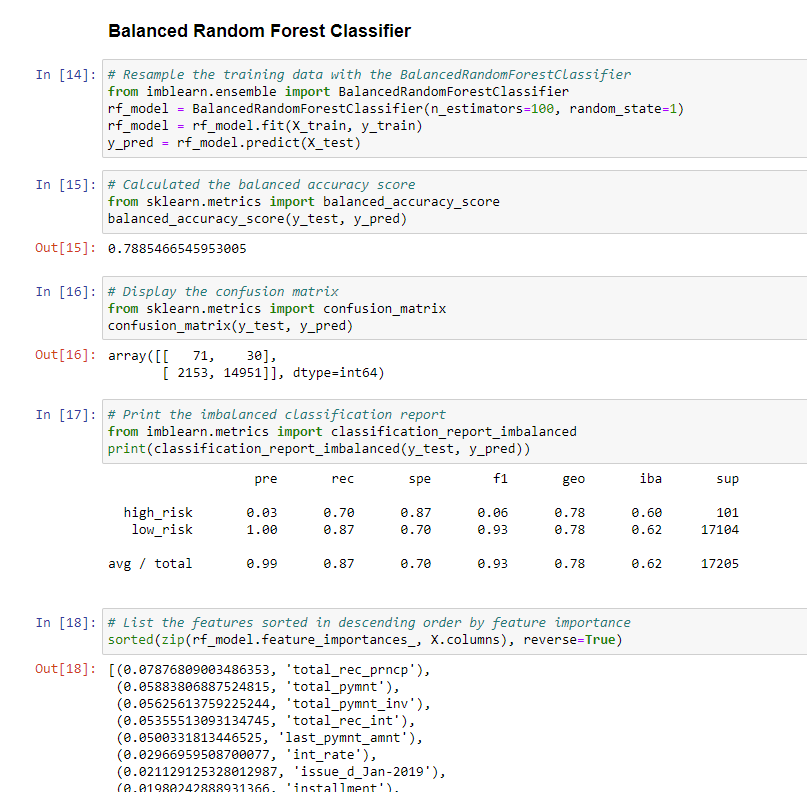
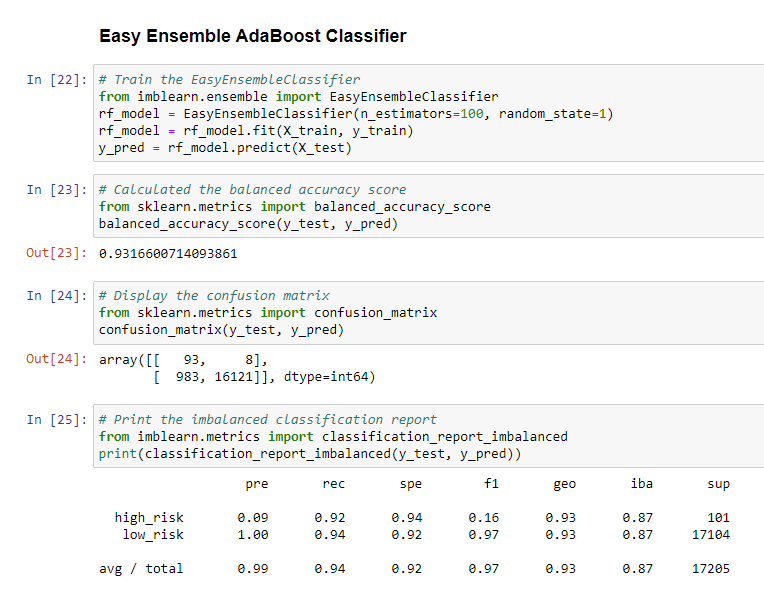

# Credit_Risk_Analysis

## Overview of the analysis:

The purpose of this assignment was to evaluate mulitple different classification modules to see if they should be used to predict credit risk.  We used RandomOverSampler, SMOTE, and ClusterCentroids to oversample the data. Then we used SMOTEEN as a combination of over and undersampling the data. Lastly we used BalancedRandomForestClassifier and EasyEnsembleClassifer to help reduce bias. After running all these analysis' we evaluated how they performed to see which one would be the best to use to predict credit risk. 

## Results: 

First we had to read the CSV in and clean the data. Then we had to split the data and decide what our target and features would be. The target was loan status so we set that to y. For X we dropped the loan status column and cleaned the rest of the data up with the pd.get_dummies function. 

Once the data was split then we could test different models.

*  **Naive Random Over Sampling**

First we compared two oversampling models.  We used the naive random sampling and the SMOTE algorithm. The naive random oversampling made it both the low and high risk were equal when running the model. This model only led to a 66% accuracy score.  For high risk the precision rate was 1% which is very poor. The recall rate was extremely low at only 54%

* **SMOTE Oversampling** 

We resampled the data using the SMOTE algorithm. Using the SMOTE oversampling model only had a 65% accuracy score which is actually less than the naive oversampling model. The precision and recall results were also similar to the oversampling results. High risk precision was 1% but the low risk recall did improve from 54% to 68%.

* **Cluster Centroids Undersampling**

Next we used the undersampling model using the cluster centroid algorithm.  This algorithm performed worse than the previous two and only had a 55% accuracy. The precision and recall rates were similar as the above with 1% precision for high risk but the low risk recall score fell to 41%.

* **SMOTEEN Over and Under Sampling**

We also tested the combination (over and under) sampling model as well.  This model had a 65% accuracy score.  The high risk precision score was similar as the other models at 1% and the low risk recall was at 57%. 

* **Balanced Random Forest Classifer**

Next we tested the Balanced Random Forest Classifier model. This model had a 78% accuracy score which is the highest accuracy score so far. The precision risk score was slightly higher at 3%.  The recall score for low risk increased to 87%. The recall score for high risk also increased to 70%. 

* **Easy Ensemble Adaboost Classifier**

Lastly, we tested the Easy Ensemble Adaboost Classifier Model.  This model has a 93% accuracy rate which had the highest accuracy rate of all the models.  The precision rate for high risk was the highest out of all models at 93%.  The recall for both low risk and high risk also increased from previous models. The recall low risk rate was a 94% and for high risk at 92%.

## Summary: 

After testing 6 different models, the Easy Ensemble Adaboost Classifier Model proved to the best model to predict credit risk. The Easy Ensemble Model had a 93% accuracy rate with an overall precision rate of 99% and an overall recall rate of 94%. The precision rate for high risk was 9% which was higher than all other models.  The recall rate for both high risk and low risk was also the highest out of all the models. Recall rate for high risk was at 92% and low risk recall rate was 94%.  The high risk precision rate is still low at 9% causing the high risk F1 score to be only 16% which means exploring other models could be worthwhile. Overall, this model has high enough accuracy and precision scores that I'd recommend this model to predict credit risk. 

